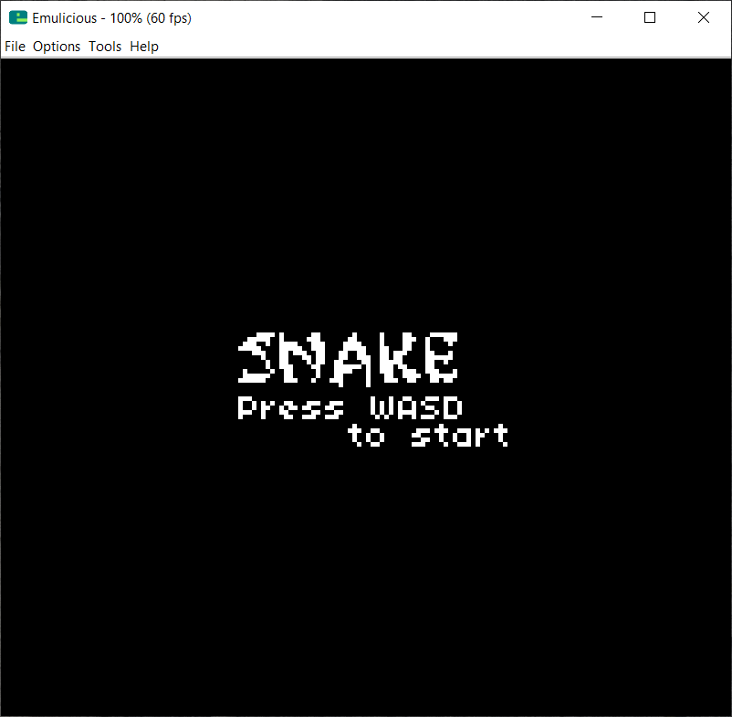
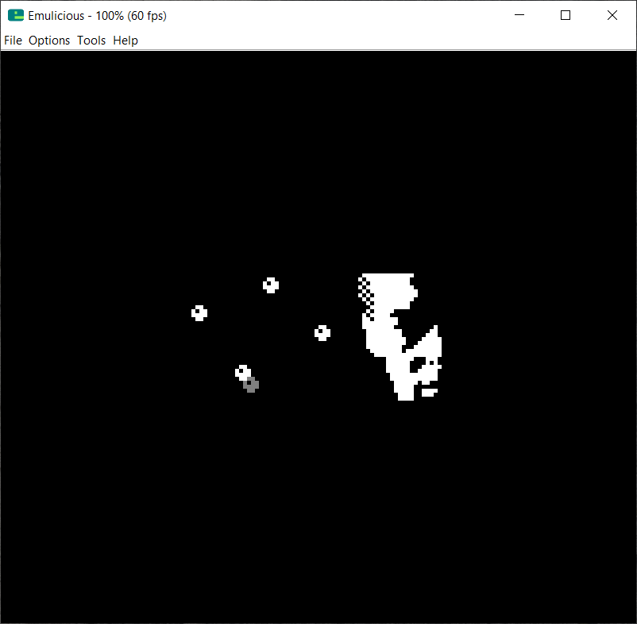

# Cobalt

Cobalt is a Chip-8 interpreter written in assembly for the Game Boy (DMG).

 &nbsp;
 &nbsp;
 &nbsp;
 &nbsp;

## Build Instructions

The `RGBDS` toolchain and `GNU Make` are required to build Cobalt.

To build the ROM, execute:

```bash
make
```

To clean the build directories, execute:

```bash
make clean
```

The `Snake` ROM from [chip8Archive](https://github.com/JohnEarnest/chip8Archive) (under the CC0 license)
is embedded into Cobalt by default, and the key mappings are like so,

| GB    | Chip-8 |
| ----- | ------ |
| Right | 0x9    |
| Left  | 0x7    |
| Up    | 0x5    |
| Down  | 0x8    |

To change the ROM file and key mappings, you need to edit the `src/rom.s` file manually.

## Note

1. The `Makefile` (with `project.mk`) is adapted from the
   [GB Boilerplate](https://github.com/ISSOtm/gb-boilerplate/) repository, which is licensed under the
   Zlib license. A copy of the license may be found in the `README/` subdirectory.

2. Tested with RGBDS version `0.9.2` and GNU Make version `4.3`. Not tested on actual DMG hardware, do it
   at your own risk! Needs an accurate emulator to run!

## License

Cobalt is licensed under the terms of the Zlib license. Earlier versions (till 1.1.0) were licensed under
the terms of the Apache-2.0 license.
