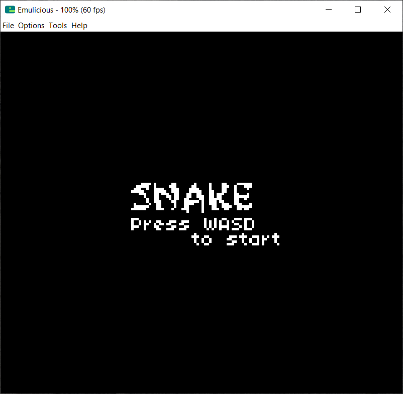
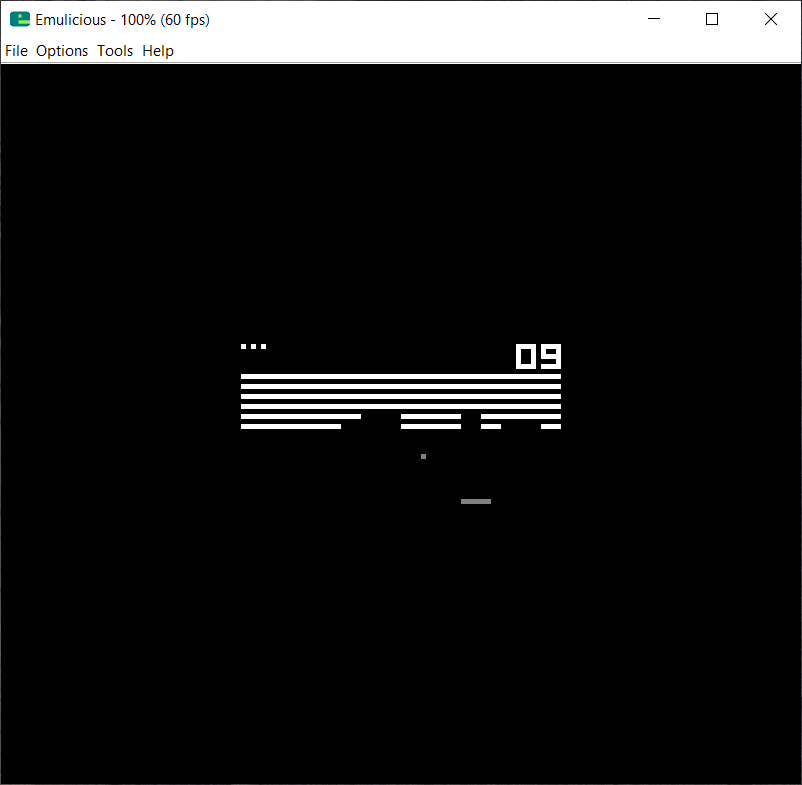
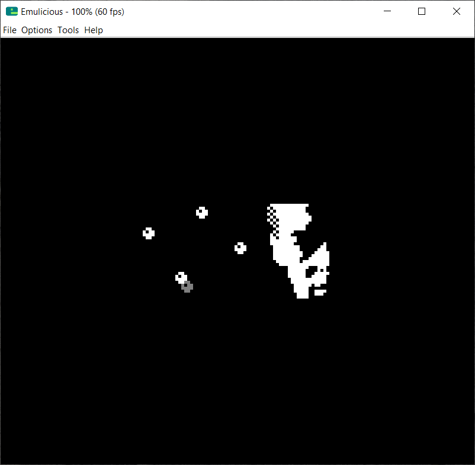

# Cobalt

Cobalt is a Chip-8 interpreter written in assembly for the Game Boy.

 &nbsp;
 &nbsp;
 &nbsp;
 &nbsp;

## Build Instructions

The `RGBDS` toolchain and `GNU Make` is required to build Cobalt from source.

```bash
make all
```

This will produce the ROM file in the `bin/` subdirectory along with some additional
debugging aids.

The `Snake` ROM is embedded into Cobalt by default, and the key mappings are like so,

| GB    | Chip-8 |
| ----- | ------ |
| Right | 0x9    |
| Left  | 0x7    |
| Up    | 0x5    |
| Down  | 0x8    |

To change the ROM file and key mappings, you need to edit the `src/rom.s` file manually.

## Note

The `Makefile` is adapted from the [GB Boilerplate](https://github.com/ISSOtm/gb-boilerplate/) repository, which is under the MIT license. A copy of the license may be found in the `README/` subdirectory.

## License

Cobalt is licensed under the terms of the Apache-2.0 license.
